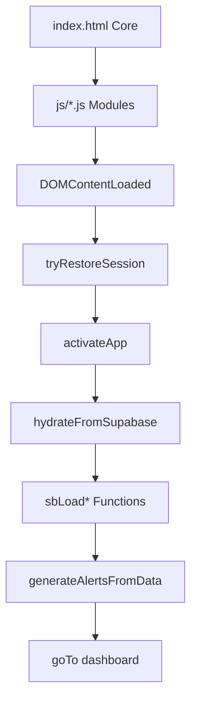

# Startup Dependency Order - AccentOS

This document maps the critical sequence required for the application to initialize correctly.

## 1. Static Asset Load (Parallel)

1. **CSS & Fonts:** Essential for layout stability.
2. **index.html Core Script:** Defines global constants (`SUPABASE_URL`, `CAT_DEFS`) and shell utilities (`$`, `esc`, `toast`).
3. **Vendor JS Modules:** (e.g., `js/customers.js`, `js/vendors.js`).
   - **Requirement:** These *must* load after the core script because they reference shell utilities.
   - **Hazard:** If a module is large and slow to load, it might not be ready when `DOMContentLoaded` fires.

## 2. Boot Sequence (Sequential)

Once the DOM is ready, the `DOMContentLoaded` listener in `index.html` executes:

1. **Session Recovery:** `tryRestoreSession()`
   - Success → Proceed to step 2.
   - Failure → Stop (user must log in).

2. **UI Activation:** `activateApp()`
   - Swaps `#login-screen` for `#app`.
   - Sets user initials and role.

3. **Data Hydration:** `hydrateFromSupabase()`
   - **Parallel Fetches:** Most `sbLoad*` calls happen concurrently.
   - **Critical Dependency:** `sbLoadScoreStates` and `sbLoadVendorScores` depend on `VD` (Vendor Data) being initialized from `VD_RAW`.

4. **Rollout Configuration:** `applyModuleModesAfterHydrate()`
   - Fetches `module_modes.json`.
   - Applies sidebar gating and navigation guards.

5. **Post-Load Heuristics:** `generateAlertsFromData()`
   - Runs *after* all other data is loaded to generate cross-module alerts.

## 3. Dependency Map

## 4. Key Risks

- **Race Conditions:** `hydrateFromSupabase` does not currently use `await Promise.all()`, meaning it's "fire and forget" parallel fetches. If `goTo('dashboard')` runs before data arrives, the dashboard may initially look empty.
- **Hoisting Assumptions:** The shell assumes all functions in `js/*.js` are available globally. If a module fails to load due to a network error, calls to its functions will crash the app.
