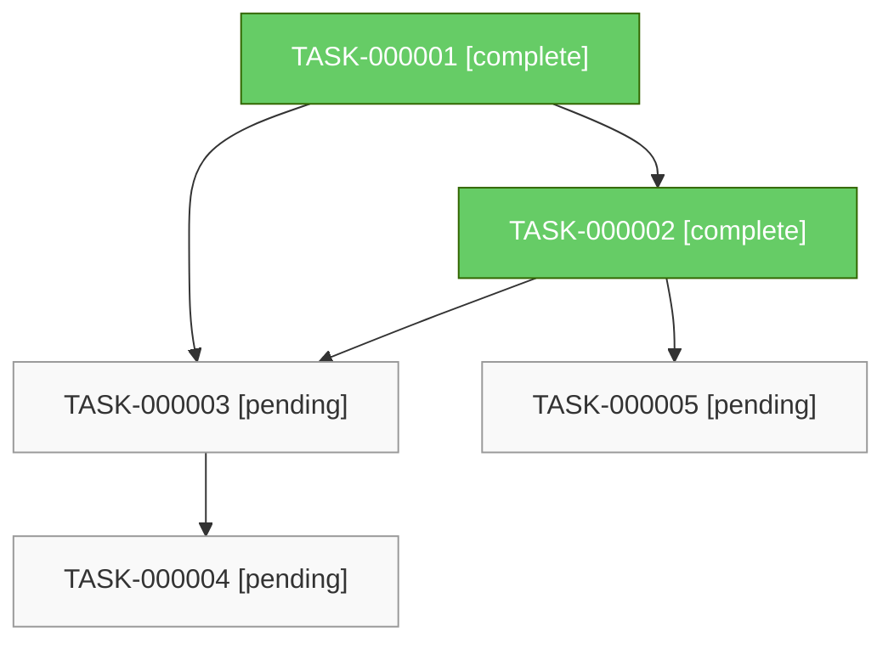

# AgentOS Task Dependency Graph

## Task Summary

| Task ID | Title | Status | Risk | Dependencies |
|---------|-------|--------|------|--------------|
| TASK-000001 | Build timestamp logger | complete | low | — |
| TASK-000002 | Build event logger | complete | low | TASK-000001 |
| TASK-000003 | Build dependency engine | pending | low | TASK-000001, TASK-000002 |
| TASK-000004 | Run production deploy | pending | critical | TASK-000003 |
| TASK-000005 | Generate runtime report | pending | medium | TASK-000002 |
