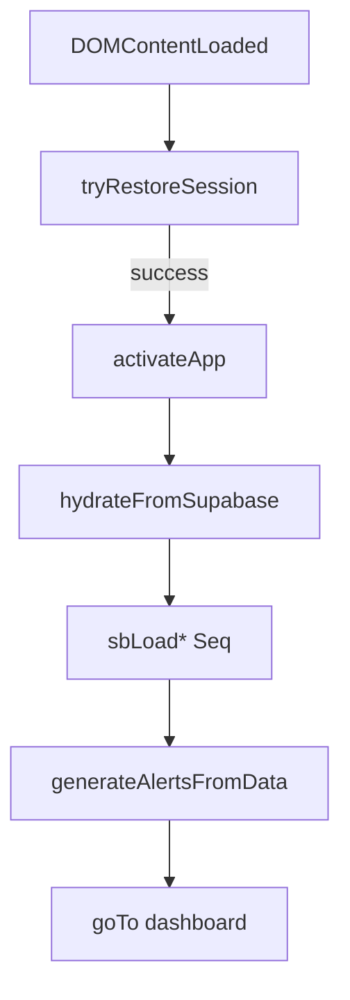

# Event Propagation Graph - AccentOS

This graph maps the flow of events and signals through the system.

## 1. Initialization Event Flow

## 2. Global UI Events
| Trigger | Action | Impact |
|---|---|---|
| `document.click` | Close FAB/Sidebar | Global UI cleanup. |
| `document.keydown` | Search/Login | `Ctrl+K` shortcut activation. |
| `dragenter / drop` | CSV Overlay | Global CSV import readiness. |

## 3. Custom Application Events
- **`roSelectRep`**: Emitted by Rep List to notify Rep View of a selection change.
- **`Realtime Changes`**: (Meetings Module) Postgres notifications trigger `imRtApply` UI updates.
