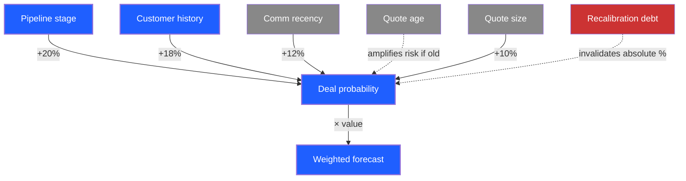

# example: AccentOS vendor probability model — full educational synthesis

> Worked example demonstrating the full educational-synthesis output set. The topic: AccentOS's 8-factor weighted probability model from BUILD_PLAN 1.5 (`js/pipeline.js:computeDealProbability`).
>
> This file is a meta-illustration of what a `/knowledge/vendor-probability-model/` folder would look like in compressed form. Use it as a calibration reference when running the skill on similar AccentOS topics.

---

## Step 0 preflight (illustration)

```
mode: deep-dive (default)
audience: intelligent non-expert (default)
domain: software / sales operations
sources: js/pipeline.js (computeDealProbability + weights), BUILD_PLAN_CLAUDE.md §1.5, BUILD_INTELLIGENCE.md (recalibration entry), MASTER.md §3 (pipeline section)
```

---

## Step 2 concept inventory (12 rows surfaced)

Per `templates/concept-inventory.md`. Excerpt:

| # | concept | def | anchor | type |
|---|---------|-----|--------|------|
| 1 | 8-factor weighted model | scoring fn combining 8 input signals into deal-close probability | js/pipeline.js:computeDealProbability | compound |
| 2 | lead source weight | 10% factor — origin of the lead | js/pipeline.js:weights | primitive |
| 3 | customer history weight | 18% factor — past frequency × monetary | js/pipeline.js:weights | primitive |
| 4 | RFM segment weight | 8% factor — VIP / Active / Lapsed / Lost / Prospect | js/customers.js:rfm | compound |
| 5 | project type weight | 10% factor — residential / trade / commercial | js/pipeline.js:weights | primitive |
| 6 | quote age weight | 12% factor — days since last quote sent | js/pipeline.js:weights | primitive |
| 7 | comm recency weight | 12% factor — days since last interaction | js/pipeline.js:weights | primitive |
| 8 | quote size weight | 10% factor — $ size of pending quote | js/pipeline.js:weights | primitive |
| 9 | stage weight | 20% factor — pipeline stage (highest weight) | js/pipeline.js:weights | primitive |
| 10 | factor breakdown UI | per-deal modal showing each factor's contribution | js/pipeline.js:openDeal | compound |
| 11 | recalibration debt | model produces relative ordering even with bad absolute % | BUILD_INTELLIGENCE.md:1.5 | primitive |
| 12 | weighted forecast | Σ(value × probability) — Pipeline header total | js/pipeline.js:render | compound |

---

## Step 3 hierarchy

**Core concepts** (the 4 that, if removed, collapse the topic):
1. 8-factor weighted model (the structure)
2. Stage weight at 20% (the dominant signal)
3. Recalibration debt (the trust caveat)
4. Weighted forecast (the operational output)

**Supporting concepts:** the other 7 factor weights (lead source, customer history, RFM, project type, quote age, comm recency, quote size) — each shapes the score but no individual one is load-bearing.

**Dependencies:**
- RFM segmentation (must exist for factor 3 to compute)
- Pipeline stage taxonomy (lead → qualified → quoted → negotiating → won/lost/abandoned)
- Customer interaction history (for comm recency)
- Quote tracking (for quote age + size)

**Strategic implications:**
1. Pipeline forecast is meaningful BEFORE absolute calibration (relative ordering is correct)
2. Stage transitions move probability the most — accelerating stage progression beats raising other factors
3. The model's bias toward stage means a "stuck" deal at high probability is a bigger risk signal than a low-probability early-stage deal
4. Until probability_model_log accumulates real win/loss outcomes, the displayed % is heuristic — Michael should communicate this internally so sales doesn't over-trust the number

---

## Step 4 relationship graph (excerpt — would be `relationships.mmd`)



---

## Step 5 — 10 internal questions (compressed)

1. **Core concepts?** 8-factor model, stage weight, recalibration debt, weighted forecast.
2. **Most important relationships?** Stage → probability (highest weight); probability × value → forecast; recalibration debt invalidates absolute % until model_log accumulates.
3. **What confuses learners?** Treating displayed probability as ground truth; assuming high probability + stalled deal = good (it's actually bad).
4. **What needs visualization?** Factor weight breakdown (pie or bar); the relationship graph; the per-deal factor modal.
5. **Strongest analogies?** Vendor scoring cascade (familiar AccentOS pattern); medical risk score (clinical analog); credit score (consumer analog).
6. **Likely misconceptions?** "85% probability means 85% chance"; "raising every factor equally helps"; "old quote auto-lowers probability proportionally."
7. **Strategic implications?** Stage acceleration > factor optimization; stuck-at-high-probability is risk signal; communicate calibration debt internally.
8. **Practical AccentOS applications?** Daily Brief stale-deals tile; pipeline forecast on dashboard; per-deal factor modal in `openDeal`.
9. **Learning order?** Foundational: what a weighted model is. Intermediate: the 8 factors + relative weights. Advanced: recalibration debt + stage dominance. Strategic: how to act on the model.
10. **Best format per concept?** 8-factor breakdown → table; weights → bar chart; relationship graph → Mermaid; recalibration debt → callout box.

---

## Step 6 analogies (excerpt — would be full `analogies.md`)

**Concept: 8-factor weighted model**

*Analogy 1 (AccentOS-native):* Like the vendor scoring cascade. Each factor maps to one signal class; the weights are the priorities. The probability score is the analog of vendor tier.

*Analogy 2 (consumer):* Like a credit score. Multiple input signals (payment history, utilization, length of history) get weighted into a single number. The number isn't the truth — it's a shorthand for the underlying signals.

**Where it breaks:** credit scores are calibrated against decades of default data. The probability model's calibration debt means our number is heuristic until probability_model_log fills.

---

## Step 8 deep-dive layers (compressed)

### Foundational (≤500 words target)

A weighted scoring model takes multiple input signals about a deal and combines them into a single number representing how likely the deal is to close. Each signal gets a weight reflecting how predictive it is. The final score is the sum of (signal value × weight).

Think of the AccentOS vendor scoring system: each metric (pricing, freight, returns, lead time) gets a weight reflecting its importance. The vendor's tier comes from the weighted sum.

The deal probability model uses the same shape — 8 factors, each weighted, summing to a probability between 0 and 100%. The model lives in `js/pipeline.js:computeDealProbability`.

**You should now be able to:**
- Explain what a weighted scoring model does
- Map the model's shape to the vendor scoring cascade
- Locate the model's code in AccentOS

### Intermediate (≤1000 words target)

The 8 factors and their weights (in decreasing order of importance):

| factor | weight | what it measures |
|--------|--------|------------------|
| Stage | 20% | Where the deal is in pipeline (lead/qualified/quoted/negotiating/won) |
| Customer history | 18% | Past frequency × monetary with this customer |
| Quote age | 12% | Days since last quote (older = lower) |
| Comm recency | 12% | Days since last customer interaction |
| Lead source | 10% | Origin (referral / website / cold) |
| Project type | 10% | Residential / trade / commercial |
| Quote size | 10% | $ value of pending quote |
| RFM segment | 8% | VIP / Active / Lapsed / Lost / Prospect bucket |

Stage weight at 20% is the largest single factor. This means stage transitions move probability the most — a deal moving from "qualified" to "quoted" gets a bigger probability bump than any other factor change.

Customer history at 18% is the second-largest factor and works through RFM cross-reference: VIP customers get the full 18%; Lost customers get near zero.

Quote age and comm recency together account for 24% — they're the "is this deal still alive" signals. A 30-day-old quote with no recent comm pulls the score down sharply.

The remaining four factors (lead source, project type, quote size, RFM) account for 38% and shape the deal's structural quality.

**You should now be able to:**
- List the 8 factors and their weights from memory
- Identify which factor moves probability most
- Explain the difference between "is the deal active" signals (quote age, comm) and "is the deal high-quality" signals (history, RFM)

### Advanced (≤1000 words target — compressed)

The model has known limits. The most important is **recalibration debt**: the displayed probability is heuristic until `probability_model_log` accumulates real win/loss outcomes and the weights are recalibrated against actual data. Until then, the relative ordering of probabilities across deals is correct, but the absolute numbers are not.

This means:
- Comparing two deals' probabilities tells you which is more likely to close (relative is good)
- The exact "85%" doesn't mean 85% of similar deals close — it means *more likely* than a deal at 75%

The second limit: **stage dominance + stuck deals**. Because stage moves probability so much, a deal that reached "negotiating" but hasn't moved in 21 days shows ~75% probability — but its real probability is much lower. The model treats stage as a leading indicator; in reality, stale stages are lagging-quality signals.

Mitigation: AccentOS's Daily Brief surfaces "Stale Deals" (no update 14d+) as a separate tile. Stuck-at-high-probability is the highest-priority intervention target.

The third limit: **factor independence assumption**. The model treats each factor as independent. In reality, customer history correlates with RFM segment (VIPs have richer histories). Double-counting is a small effect with current weights; would be larger if RFM weight were raised.

**You should now be able to:**
- Explain why absolute probability % is unreliable until recalibration
- Identify a stuck-at-high-probability deal as a risk signal, not a positive signal
- Name the factor independence issue

### Strategic (≤500 words target — compressed)

Three strategic implications for AccentOS operations:

1. **Stage acceleration > factor optimization.** Sales effort that moves a deal forward one stage produces a bigger probability bump than effort across all other factors combined. Operationally: prioritize stage-blocker conversations (what's preventing qualified → quoted; what's preventing negotiating → won) over outreach cadence improvements.

2. **Stuck-at-high-probability is the strongest risk signal in the pipeline.** A deal at 80% in negotiating for 21+ days is more dangerous than a deal at 30% in lead. The first looks healthy and won't be triaged; the second looks weak and gets natural attention. The Stale Deals tile in Daily Brief addresses this — keep it visible.

3. **Communicate calibration debt internally.** When sales asks "is this 85% deal likely to close?", the honest answer is "more likely than the 70% deal next to it; we don't know the absolute rate yet." Until probability_model_log accumulates ~6 months of win/loss data, treat absolute % as relative ranking.

**You should now be able to:**
- Decide whether stage-acceleration or factor-improvement is the right intervention for a specific deal
- Distinguish high-probability deals from healthy deals
- Communicate the model's calibration limits to sales without undermining trust in the relative ranking

---

## Other artifact files (illustrated by name only — full versions would be generated)

- `executive-summary.md` — 1-page version compressed to TL;DR + strategic implications
- `concept-glossary.md` — alphabetical: 8-factor model, comm recency, customer history, factor breakdown UI, lead source, project type, quote age, quote size, RFM segment, recalibration debt, stage weight, weighted forecast
- `notebooklm-prompt.md` — drop-in NotebookLM prompt with full deep-dive embedded
- `mind-map.md` — Markmap version of the Step 3 hierarchy
- `relationships.mmd` — full Mermaid graph
- `faq.md` — 12 questions across foundational/intermediate/advanced/strategic
- `misconceptions.md` — 5 misconceptions including "85% means 85% chance"
- `discussion-questions.md` — 6 prompts covering reflection / challenge / scenario / synthesis
- `practical-applications.md` — Daily Brief tile usage, factor breakdown modal usage, recalibration roadmap
- `risks-limitations.md` — recalibration debt + stage dominance + factor independence

## Re-running this synthesis

```
"Re-do educational synthesis on vendor-probability-model in deep-dive mode"
```

The skill regenerates the full artifact set. If new evidence has accumulated (e.g., probability_model_log now has data), the recalibration-debt section gets updated.
